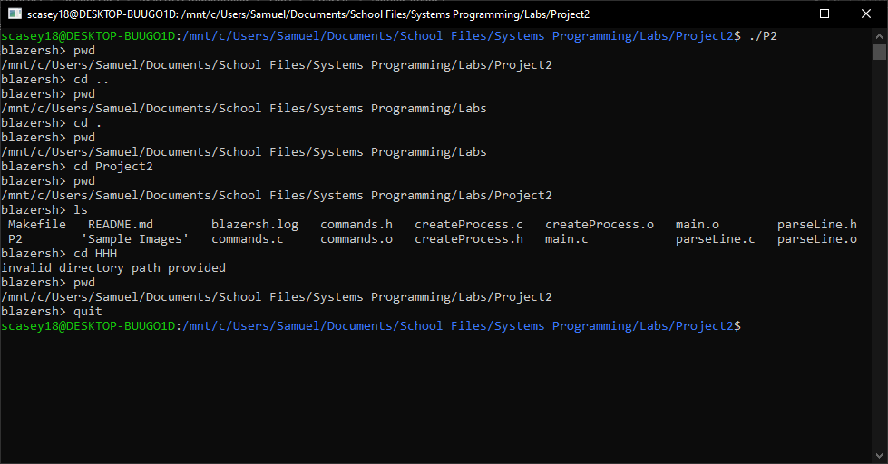
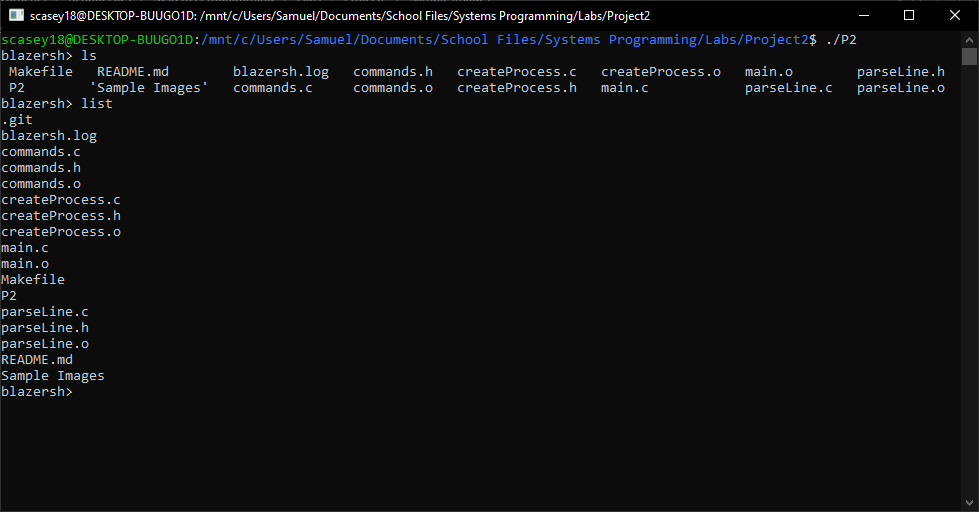
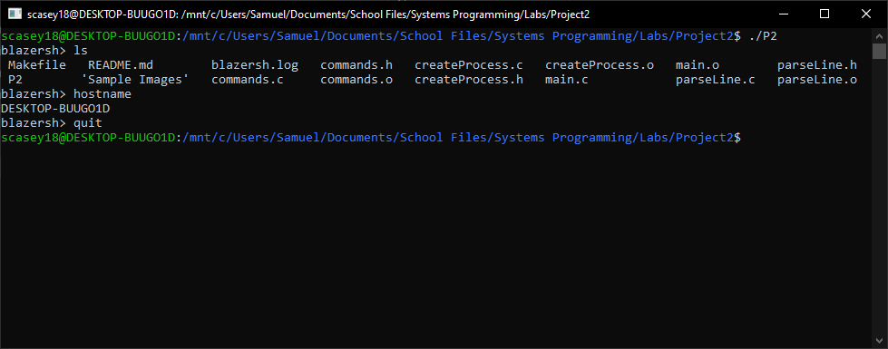

# System Programming (CS 332) Project 2

## Description
This is the project page for the Spring 2019 UAB Systems Programming class.
This is a C shell implementation with the following functions in the shell.
- list    : This function will list all files in the directory defined by the PWD enviornment variable, one line each.
- help    : Will list all the functions included in the shell provided by the programmer and the proper syntax.
- cd      : Changes the PWD enviornment variable to the path defined within the function call if it is valid. 
- history : This will print all the previous commands typed into the terminal that were saved to the blazersh.log file this session.
- quit    : Will exit and close the current terminal interface

## Author
Samuel Casey

## Getting Started

Prerequisites/dependencies
installed gcc compiler 

Instructions for building the software
1. Clone this repository
2. Navigate to this repository 
3. Run the make utility - run "make clean" to remove the .o files after compiling
4. Run the executable "./P2"

## Running the test

Running test cases

Run these test cases just involves running the "./P2" file

Sample test cases
1. Navigate the file hierarchy by using cd (. , .. , pathname)
2. run functions defined in PATH or running from folders at the PWD location
3. Navigate to another folder using the terminal and run a local executable

## Screenshots/Sample Session

## Contact Information
Email: scasey18@uab.edu