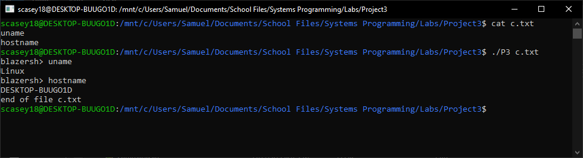
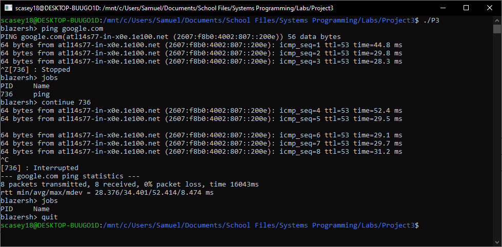

# System Programming (CS 332) Project 3

## Description
This is the project page for the Spring 2019 UAB Systems Programming class.
This is a C shell implementation with the following functions in the shell.
- list    : This function will list all files in the directory defined by the PWD enviornment variable, one line each.
- help    : Will list all the functions included in the shell provided by the programmer and the proper syntax.
- cd dir  : Changes the PWD enviornment variable to the path defined within the function call if it is valid. 
- history : This will print all the previous commands typed into the terminal that were saved to the blazersh.log file this session.
- jobs    : Print list of programs that are stopped (Control-Z).
- continue: start a process that has been stopped already. Run jobs to see those avaliable.
- quit    : Will exit and close the current terminal interface

## Author
Samuel Casey

## Getting Started

Prerequisites/dependencies
installed gcc compiler 

Instructions for building the software
1. Clone this repository
2. Navigate to this repository 
3. Run the make utility - run "make clean" to remove the .o files after compiling
4. Run the executable "./P3"

## Running the test

Running test cases

Running the test cases just involves running the "./P3" standalone or with an argument pointing to a file with commands.

Sample test cases

1. Run "./P3 <file>" containing a list of commands to see the output from all commands in the file.
2. Start and stop a long running process using Control-Z and Control-C to see the results.
3. Stop a process (Control-Z) and run the command "jobs" to see the stopped process. 

## Screenshots/Sample Session

## Contact Information
Email: scasey18@uab.edu