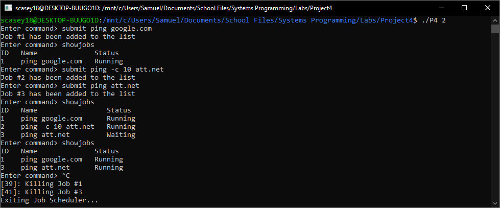

# System Programming (CS 332) Project 4

## Description
This is the project page for the Spring 2019 UAB Systems Programming class.
- showjobs     : List all jobs currently running or waiting to be run
- submit <job> : Submits the job to be run in order
- help         : Displays a screen with included commands and syntax

All output from commands will be stored in <jobid>.out and <jobid>.err respectively.

## Author
Samuel Casey

## Getting Started

Prerequisites/dependencies
installed gcc compiler 

Instructions for building the software
1. Clone this repository
2. Navigate to this repository 
3. Run the make utility - run "make clean" to remove the .o files after compiling
4. Run the executable "./P4 <number of cores>"

## Running the test

Running test cases

Running the test cases just involves running the "./P4" with an argument for the number of cores.

## Screenshots/Sample Session

## Contact Information
Email: scasey18@uab.edu